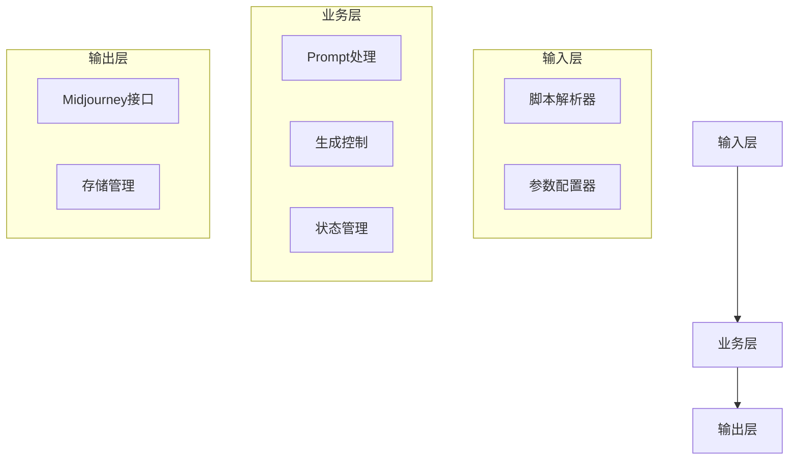

# 睡前故事绘本生成系统PRD

## 文档信息
| 属性 | 内容 |
|------|------|
| 项目名称 | 睡前故事绘本生成系统 |
| 版本号 | v1.0 |
| 作者 | 系统设计团队 |
| 最后更新 | 2025-02-23 |
| 状态 | 草稿 |

## 1. 项目概述

### 1.1 背景
当前儿童绘本创作过程中，从故事到插画的转化需要大量人工工作。通过AI技术，特别是Midjourney的文生图能力，我们可以将这个过程自动化，提高创作效率。

### 1.2 目标
开发一个自动化系统，能够：
1. 解析睡前故事分镜脚本
2. 生成统一风格的插画
3. 保持角色形象一致性
4. 自动化工作流程

### 1.3 范围
- **包含**：
  - 故事脚本解析
  - Prompt生成与管理
  - Midjourney参数配置
  - 图片生成流程控制
  - 结果存储与管理
- **不包含**：
  - 故事创作功能
  - 图片后期处理
  - 排版与出版

## 2. 用户需求

### 2.1 目标用户
- 儿童故事创作者
- 绘本出版工作者
- 教育内容制作者

### 2.2 用户痛点
1. 手动处理多场景Prompt效率低
2. 难以保持角色形象一致性
3. 缺乏系统化的生成过程管理
4. 参数调优需要专业知识

### 2.3 解决方案价值
1. 自动化工作流程，提高效率
2. 通过参数复用确保一致性
3. 标准化生成流程
4. 降低技术门槛

## 3. 功能需求

### 3.1 核心功能

#### 3.1.1 脚本解析
- 支持Markdown格式输入
- 识别三类关键Prompt：
  - 核心角色
  - 整体画风
  - 场景分镜
- 提取关键参数和描述

#### 3.1.2 Prompt管理
- 默认参数配置：
  ```json
  {
    "version": "6",
    "aspect_ratio": "3:2",
    "quality": 2,
    "style": "cute",
    "chaos": 30,
    "stylize": 1000
  }
  ```
- 支持参数覆盖
- 自动注入URL引用

#### 3.1.3 图片生成控制
- 分阶段生成：
  1. 核心角色图（4选1）
  2. 整体画风图（4选1）
  3. 场景分镜图
- 支持生成暂停与继续
- 错误重试机制

#### 3.1.4 结果管理
- 分类存储生成结果
- 生成进度追踪
- 结果报告生成

### 3.2 可选功能
- 批量生成队列
- 图片预览界面
- 参数推荐系统
- 历史记录查询

## 4. 技术规格

### 4.1 系统架构


### 4.2 数据结构

#### 4.2.1 配置文件（config.json）
```json
{
    "project": {
        "name": "项目名称",
        "created_at": "创建时间",
        "status": "状态"
    },
    "parameters": {
        "default": {
            "version": "6",
            "ar": "3:2",
            "q": 2
        },
        "custom": {}
    },
    "resources": {
        "character": {
            "prompt": "角色描述",
            "variants": ["url1", "url2", "url3", "url4"],
            "selected": 1
        },
        "style": {
            "prompt": "画风描述",
            "variants": ["url1", "url2", "url3", "url4"],
            "selected": 2
        }
    }
}
```

#### 4.2.2 进度文件（progress.json）
```json
{
    "status": "进行中",
    "current_stage": "场景生成",
    "completed": [
        "角色生成",
        "画风生成"
    ],
    "pending": [
        "场景3",
        "场景4"
    ],
    "errors": []
}
```

### 4.3 目录结构
```
project/
├── config.json
├── progress.json
├── output/
│   ├── characters/
│   │   ├── selected.jpg
│   │   └── variants/
│   ├── style/
│   │   ├── selected.jpg
│   │   └── variants/
│   └── scenes/
│       ├── scene1.jpg
│       ├── scene2.jpg
│       └── ...
└── logs/
    └── generation.log
```

## 5. 用户界面

### 5.1 命令行界面
```bash
# 基本用法
$ python main.py --input story.md

# 自定义参数
$ python main.py --input story.md --params custom_params.json

# 继续中断的任务
$ python main.py --resume project_id
```

### 5.2 交互流程
1. **角色图片选择**
   ```
   生成完成，请选择角色图片（1-4）：
   1. [缩略图1] 2. [缩略图2]
   3. [缩略图3] 4. [缩略图4]
   > 输入选择：
   ```

2. **画风图片选择**
   ```
   生成完成，请选择画风图片（1-4）：
   1. [缩略图1] 2. [缩略图2]
   3. [缩略图3] 4. [缩略图4]
   > 输入选择：
   ```

3. **进度展示**
   ```
   正在生成场景 [===>    ] 3/8
   当前场景：森林里的动物们
   预计剩余时间：5分钟
   ```

## 6. 非功能需求

### 6.1 性能要求
- 单次图片生成响应时间 < 90秒
- 支持最多10个并发生成任务
- 系统启动时间 < 5秒

### 6.2 可靠性
- 支持断点续传
- 错误自动重试（最多3次）
- 完整的错误日志记录

### 6.3 扩展性
- 模块化设计
- 可配置的参数系统
- 插件化的存储接口

### 6.4 安全性
- 输入验证和清理
- 资源访问控制
- 敏感信息加密存储

## 7. 错误处理

### 7.1 错误类型
1. 输入错误
   - 脚本格式错误
   - 参数验证失败
   - 文件访问错误

2. 处理错误
   - Prompt生成失败
   - 参数注入失败
   - 状态更新失败

3. 外部错误
   - API调用失败
   - 网络连接中断
   - 存储空间不足

### 7.2 恢复策略
1. 自动重试
   - 指数退避算法
   - 最大重试次数限制
   - 重试日志记录

2. 手动干预
   - 错误通知
   - 人工确认机制
   - 回滚选项

## 8. 项目实施

### 8.1 开发阶段
1. 准备阶段（1周）
   - 环境搭建
   - 依赖安装
   - 接口测试

2. 核心开发（2周）
   - 解析器实现
   - 生成控制
   - 存储管理

3. 测试优化（1周）
   - 单元测试
   - 集成测试
   - 性能优化

### 8.2 验收标准
1. 功能验收
   - 所有核心功能正常工作
   - 错误处理机制有效
   - 数据持久化正确

2. 性能验收
   - 满足响应时间要求
   - 资源使用合理
   - 并发处理正常

3. 文档验收
   - 完整的使用文档
   - 清晰的API文档
   - 详细的部署文档

## 9. 风险评估

### 9.1 技术风险
| 风险 | 概率 | 影响 | 缓解措施 |
|------|------|------|---------|
| API限流 | 高 | 中 | 实现请求队列 |
| 生成失败 | 中 | 高 | 完善重试机制 |
| 数据丢失 | 低 | 高 | 备份机制 |

### 9.2 项目风险
| 风险 | 概率 | 影响 | 缓解措施 |
|------|------|------|---------|
| 进度延迟 | 中 | 中 | 任务分解 |
| 需求变更 | 高 | 中 | 灵活设计 |
| 资源不足 | 低 | 高 | 提前规划 |

## 10. 附录

### 10.1 术语表
| 术语 | 说明 |
|------|------|
| Prompt | 用于生成图片的文本描述 |
| 分镜 | 故事情节的场景划分 |
| URL注入 | 将已生成图片的URL作为参数注入到新的Prompt中 |

### 10.2 参考文档
- Midjourney API文档
- Discord API文档
- 项目代码规范

### 10.3 修订历史
| 版本 | 日期 | 修改内容 | 作者 |
|------|------|----------|------|
| v1.0 | 2025-02-23 | 初始版本 | 系统设计团队 |
